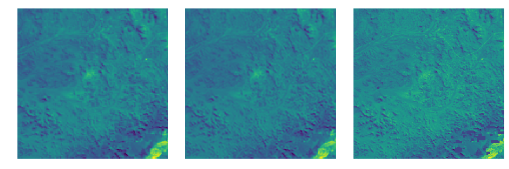
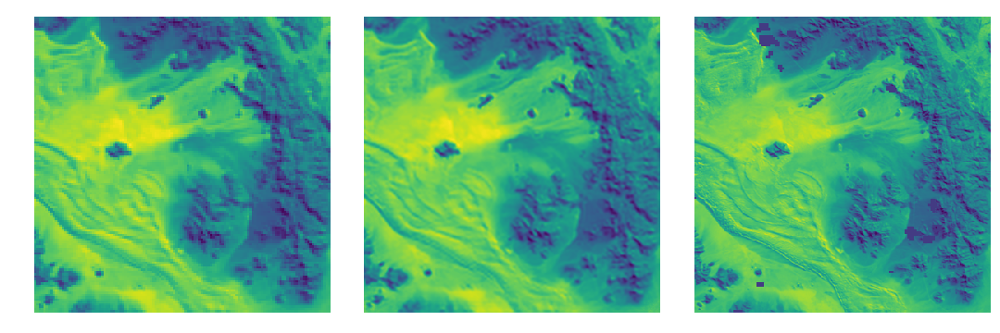
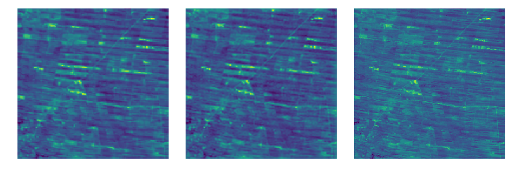

# PROBA-V Super Resolution - Solved with SRGAN

This repository contains my submission code to the challenge [Proba-V Super Resolution](https://kelvins.esa.int/proba-v-super-resolution/home/).

The solution proposed here is a Super Resolution Generative Adversarial Network, as described in this [paper](https://arxiv.org/pdf/1609.04802.pdf).

The architecture is slightly modified from the original paper (mainly for performance concerns).

## Changes from Original Paper:
    * 16 Residual blocks used, but only 1 upsampling block instead of 2.
    * As per suggestion from http://distill.pub/2016/deconv-checkerboard/, we are using UpSampling2D as a
      simple Nearest Neighbour Upsampling instead of SubPixelConvolution.
    * The number of discriminator filters were all divided by 2, to shrink amount of trainable parameters.
    * Loss Function: a specefic loss function was defined and used as per the competition scroing: https://kelvins.esa.int/proba-v-super-resolution/scoring/
    
## Requirements:

    You will need the following to run the above:
    Python 3.6
    tensorflow 1.12.0
    keras 2.2.4
    numpy 1.16.1
    skimage 0.14.2  (very important to get this specific version)
    matplotlib, scipy
    
    For training: Good GPU, I trained this model using my trusty NVIDIA GTX 1080.
    It is advised to train this model using a better GPU with more VRAM.

## Data set:
    to get the dataset, run this command on your shell:
    >> python getData.py
    
    * This will also create an "output" directory to store results (images and .h5 files)

## How to use:
    
    * clone or download this repository,
    * run the "getData.py" first,
    * then run "train.py" (after adjustments)
    
    Note : Please change the number of epochs and batch size accordingly from within the train.py file. by default, the model
    runs for 1000 epochs, with 2 batch size. (It is advised to run this model for more than that!!)
    
    
 ## Sample Results:

Left  : Low Resolution Image (input)
Middle: Super Resolution Image (prediction)
Right : High Resolution Image (ground truth)

    

## Refrences:

    Paper:
    Photo-Realistic Single Image Super-Resolution Using a Generative Adversarial Network :
    https://arxiv.org/pdf/1609.04802.pdf
    
    Useful github pages:
    https://github.com/lfsimoes/probav
    https://github.com/fchollet/deep-learning-with-python-notebooks/blob/master/8.5-introduction-to-gans.ipynb
    https://github.com/deepak112/Keras-SRGAN
    https://github.com/eriklindernoren/Keras-GAN/tree/master/srgan
    https://github.com/krasserm/super-resolution
    
    Challenge Website:
    https://kelvins.esa.int/proba-v-super-resolution/problem/
    
